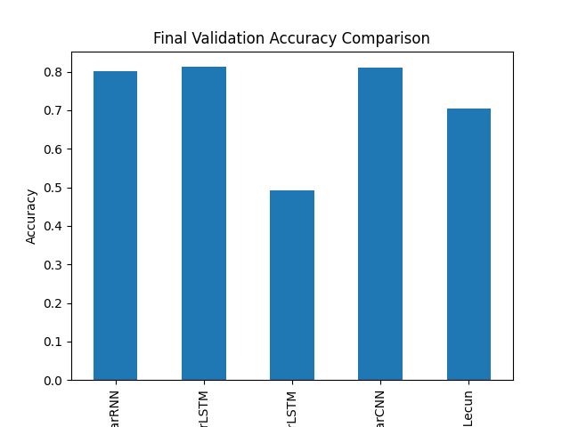

# Project Overview: Chatbot Language Prediction Model

---

**Quick Overview: TL;DR**  
This project was all about creating a machine learning model to predict the last character in chatbot language
sequences. It's a blend of careful data exploration, trying out various models, and a lot of learning along the way. The
highlight?

This project utilizes cutting-edge technologies such as Python, SciKit-Learn, PyTorch, LSTM, and CNNs. We've also integrated tools like Optuna for hyperparameter optimization, ensuring a robust and efficient model development process.

An LSTM model that hit a sweet spot with accuracy!

| Data File             | Description                          | Size | Notes                                                 |
|-----------------------|--------------------------------------|------|-------------------------------------------------------|
| train.csv             | Training data for the model          | 2543 | Main dataset for model training                       |
| answers.csv           | Contains labels for training data    | 379  | Used for supervised learning                          |
| hidden.csv            | Unlabeled data for model validation  | 379  | Equivalent to answers.csv but without labels          |
| processed/test_X.csv  | Same as hidden.csv                   | 379  | Same as hidden.csv                                    |
| processed/test_y.csv  | List of last char of answers.csv     | 379  | Contains the label for each sequence in test_X.csv    |
| processed/train_X.csv | Sequences of 8 chars from train.csv  | 2289 | Derived from train.csv (90% of 2543)                  |
| processed/train_y.csv | Last char of each sequence in train  | 2289 | Corresponds to train_X.csv                            |
| processed/valid_X.csv | Sequences of 8 chars for validation  | 256  | Derived from train.csv (10% of 2543)                  |
| processed/valid_y.csv | Last char of each sequence in valid  | 256  | Corresponds to valid_X.csv                            |

---

### What's Inside?

1. **Objective**:  
   **Why This Matters**: We're diving into the unique world of chatbot language. The goal? To crack the code of their
   language patterns using machine learning.

2. **Data Analysis (The Detective Work)**:  
   **EDA**: Rolled up the sleeves and dug into the data. This was all about spotting patterns, quirks, and getting the
   lay of the land.  
   **Visual Magic**: Charts and graphs galore! These were our tools to make sense of the data visually. They’re not just
   pretty pictures; they tell the story of our data.
   I didn't find too much interesting things in when I explored the dataset. It seems clean already. Found out that
   it `hidden.csv` is basically `answers.csv` without labels (target char values). So, we'll just use the conventional
   train/test splits.

3. **Model Playground**:
   We started with basic models like Scikit-learn's classifiers to establish a baseline. Understanding the fundamental behavior of simpler models helps in appreciating the complexity and strengths of more advanced models like RNNs and LSTMs, which are renowned for their efficiency in sequence modeling. The experimentation with CNNs, particularly CharCNN, was driven by their proven capability in feature extraction from fixed-size input, a valuable asset in language pattern recognition.

4. **Tackling Challenges (The Gritty Part)**:  
   **Fighting Overfitting**: Addressing overfitting was crucial for model reliability. Techniques like regularization and early stopping were employed to maintain the balance between model complexity and generalization.
   **Refining and Tweaking**: A mix of patience, frustration, and ‘aha’ moments as we refined the models for better
   accuracy.

5. **The Results**:  
   **LSTM for the Win**: This model was the star, hitting high accuracy marks.

6. **Wrapping Up and Looking Ahead**:  
   **Insights and Takeaways**: More than just numbers and charts, this project was a journey in problem-solving and
   creativity.  
   **Future Pathways**: There's always room to grow. We've got some ideas on where to take this next!

---

**How to Navigate This Repo:**

- Dive into the `notebooks` folder for all my experimental trials and EDA.
- Check out `src` for the nuts and bolts of the models.
- `results` is where you’ll see how things panned out with each trial.

```commandline

├── notebooks
│   ├── lstm-trial3-early-stopping-w-hpo-Copy1.ipynb
│   ├── lstm-trial5-CNN-v1.ipynb
│   ├── lstm-trial1-architecture.ipynb
│   ├── lstm-trial5-CharCNN-Y.Lecun.ipynb
│   ├── failed/
│   ├── lstm-trial5-CNN-Copy1.ipynb
│   ├── sklearn-mnb-svm-2-bigram.ipynb
│   ├── lstm-trial4-next-char-loss-Copy1.ipynb
│   ├── lstm-trial2-dl-w-valid-dataset-split.ipynb
│   ├── rnn-trial1.ipynb
│   ├── lstm-trial3-early-stopping-w-hpo.ipynb
│   ├── eda.ipynb
├── tests/
├── src
│   ├── train.py
│   ├── constants.py
│   ├── utils.py
│   ├── dataset.py
│   ├── data_loader.py
│   ├── models.py
│   └── trainer.py
├── results
├── Makefile
├── SOLUTION.md
├── trained_models
│   └── [saved models here...]
├── README.MD
├── requirements.txt
└── data
    ├── processed/
    ├── train.csv
    ├── answers.csv
    └── hidden.csv
```

This structure is meant to be as clear to the user as possible. Two things are developed here:

1. Notebooks:  providing a clear, interactive medium for data exploration and initial model trials.
2. Systematic testbed for training and evaluating models:
   facilitating streamlined training and evaluation of multiple model combinations, enhancing the efficiency and
   robustness of the machine learning process. Also makes it easier to track and debug and scale the project if we're to
   mimic a real-world scenario.

This meant to be a one-liner like:

```commandline
python src/train.py --model_name CharLSTM [--option1 val1]
```

to enable include as many controlled variables as needed. (This is still WIP.)

---

### Results

### Results Comparison in Chatbot Language Prediction Project

In our journey to decode chatbot language, we experimented with various models, each bringing its own flavor to the
table. Here’s a snapshot of how they fared against each other:

#### 1. **CharRNN (Simple RNN)** - Accuracy: 80.21%

Our starting point. Simple yet effective to a degree. Great for understanding the basics of sequence modeling.
Did a decent job but hinted that we needed more sophistication to capture the nuances of chatbot language.

#### 2. **CharLSTM (LSTM with Regularization)** - Accuracy: 81.27%

Stepped up the game with LSTM. The regularization helped us balance the model's learning, preventing overfitting.
Showed better grasp of sequential patterns. The improved accuracy was a nod to LSTM's ability to remember and forget
selectively.

#### 3. **NextCharLSTM (Modeling Subsequences)** - Accuracy: 49.11%

This was a twist – predicting the next character instead of the last. A different approach to understand how well the
model captures sequence context.
The drop in accuracy was intriguing. It showed that predicting the next character in this context was more challenging
than the last.

#### 4. **CharCNN (Good for Fixed Size)** - Accuracy: 81.00%

This model brought a different perspective with its ability to capture spatial hierarchies in data.
Performed well, especially considering the fixed size of inputs. Demonstrated the strength of CNNs in capturing
essential features.

#### 5. **CharCNNYLecun (Inspired by Yann Lecun et al., 2015)** - Accuracy: 70.45%

Aimed at modeling languages more effectively. Needed more data to truly shine.
Though not the top performer, it was a valuable learning experience. Highlighted the potential of this approach with
more data.

As a summary, the following table tells it all about the models used:

| Model              | Explanation                                                                                                                                                                            |
|--------------------|----------------------------------------------------------------------------------------------------------------------------------------------------------------------------------------|
| CharRNN (Simple RNN) | Good for basic understanding, but limited in capturing long-term dependencies in sequences (we have a short length here though), but still not enough to catpute the nuanced patterns. |
| CharLSTM (LSTM with Regularization) | LSTMs are better at remembering long-term patterns, a key feature in language modeling, hence the improved accuracy.                                                                   |
| NextCharLSTM       | Predicting the next character requires understanding immediate context, a different challenge than predicting the last character, explaining the lower accuracy.                       |
| CharCNN            | CNNs excel in extracting spatial hierarchies of features, which is beneficial for fixed-size inputs but might miss some sequential nuances.                                            |
| CharCNNYLecun      | This model, inspired by Yann Lecun's work, is potent but requires extensive data to truly excel, explaining the moderate performance.                                                  |


#### ☀ ☀ Note: These results are taken systematically from the testbed. More optimized scores are found under this folder: [notebooks](./notebooks/)




## Technical Stuff

Python Version:

```
Python 3.11.6
```

You can use `make` to run the commands like

```
make setup
make test
make train_all
```

In the experiments, I used plain `pytorch==2.1.1` implementation. At first, I used CPU only, then I shifted to GPU
acceleration
since experiments started to get longer especially after tuning.

[`Optuna`](https://optuna.org/) was one of the choices for running hyper-param opt., I had tried it for a long time in the past, and it sounded
among the best next to `randomSearch` and `gridSearch`.

## Thoughts & Future Work

Here are some thoughts on where we could head next:

**Expanding the Dataset**: More data could be a game-changer, especially for models like CharCNNYLecun. Data
augmentation might be a key strategy here, allowing models to learn from a more diverse set of examples.

**Rethinking NextCharLSTM**: The lower accuracy in NextCharLSTM is intriguing. It opens up a whole new challenge – why
is predicting the next character harder, and how can we get better at it? This could lead to some interesting insights
into how these models understand and generate language.

**Combining Forces with Ensemble Models**: There's power in numbers. By combining the strengths of various models like
CharRNN, CharLSTM, and CharCNN, we might achieve more accurate and reliable predictions.

**Fine-Tuning and Experimentation**: There's always room to tweak and improve. More extensive hyperparameter tuning
could squeeze out extra performance from our existing models.

In a future work, we could delve into attention mechanisms, enhancing model sensitivity to different parts of the input sequence.
Could be an overkill, however, exploring Transformer models could provide breakthroughs in sequence modeling owing to their parallel processing capabilities and efficiency.

-----

Thank you for taking the time to read this work.

Looking forward for your feedback :)

Have a great day :D
